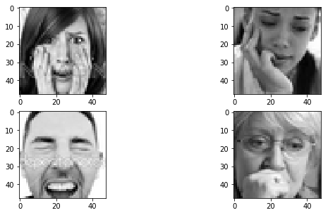

# An attempt to predict emotion, age, gender and race from face images using Pytorch

During my internship, when I started reading papers in NLP 
implementing neural network architectures with dynamic computation graphs,
I felt the need to switch to a framework other than Tensorflow. This is how I discovered 
Pytorch and was really attracted by its simplicity given my Python background.

After doing all the tutorial from the official pytorch website, I thought it might
be interesting for me to try and implement a project end-to-end using pytorch 
so that I can ensure myself I really understood how Pytorch works under the hood.
I ended up doing this funny project I named DEmoClassi which stands for :
**D**emographic (age, gender, race) and **Emo**tion **Classi**fication.
It consists simply of predicting the age, gender, race and facial expression of a
person from his/her face image.

In this post, I'll try to explain how I dealt with this task using pytorch and pytorch-ignite
(a high-level wrapper of pytroch).

The post will consist of the following : 
* Presenting the datasets I used
* Models training
* Performance evaluation
* and finally model deployment using opencv ot make predicitions in real-time 

## 1. Prepare the environment on google colab

Training deep learning models requires sometimes GPU to train faster and thus 
to be able to experiment with various architectures. Fortunately enough, 
[Google Colab](https://colab.research.google.com) provides jupyter notebooks attached 
to backends with GPU support for free. For more information on how to get started with google colab, 
[this link](https://www.youtube.com/watch?v=inN8seMm7UI&list=PLQY2H8rRoyvyK5aEDAI3wUUqC_F0oEroL), 
[this one](https://www.youtube.com/watch?v=SkV82klGbVw) and also [this one](https://www.youtube.com/watch?v=f1UK8KPt-KU)
 are good places to start with.

However, I used to program my functions during my daily commute and don't
necessarily have access to internet connection at this time. So for productivity 
reasons I decided to gather all the utility functions I develop during my commute 
in a pip installable package so that when I come home I can just do  
`pip install my-awesome-package` on google colab and start model training. 
That's how I created my first package called `democlassi` which is just a collection
of my utility functions/classes to easy data processing, model training 
and evaluation.

So to start let's install the so called democlassi package :

```sh
pip install --upgrade democlassi
```
 That's it, now I have access to my functions and can move to the next step : get the data in !

Let's also import all the necessary modules we'll need later.

```python

import torch
import torchvision.transforms as transforms

from vision_utils.custom_torch_utils import load_model
from vision_utils.custom_architectures import SepConvModelMT, SepConvModel, initialize_model

from emotion_detection.evaluate import evaluate_model as eval_fer
from emotion_detection.fer_data_utils import get_fer_dataloader
from emotion_detection.train import run_fer

from multitask_rag.train import run_utk
from multitask_rag.utk_data_utils import get_utk_dataloader
from multitask_rag.evaluate import evaluate_model as eval_utk
from multitask_rag.utk_data_utils import display_examples_utk

import pandas as pd
import glob
import os
import random

from google.colab import drive
```

## 2. The datasets 

First of all, let's connect our google drive to the currently running google colab notebook by running the following :
```python

drive.mount('gdrive')
```
This command will prompt you with a token that you can click and it will redirect you to your google account so that you can 
authenticate yourself.

I like connecting to my google drive because it allows me to save periodically my model checkpoints during training,
which is quite useful in case you lose your connection or an error happens during training.

Now my google drive is mounted at `'/content/gdrive/My Drive'` and if I execute the following command I can see the list 
of my files and folders
```python
!ls '/content/gdrive/My Drive' 
```
I used two different datasets for the tasks at hand :
### 2.1. Fer2013 dataset

Fer2013 is a kaggle dataset which consists of a set of 48x48 grayscale images representing the following facial expressions :
    * 0 : Angry
    * 1 : Disgust
    * 2 : Fear
    * 3 : Happy
    * 4 : Sad
    * 5 : Surprise
    * 6 : Neutral

One 
[can download the data here](https://www.kaggle.com/c/challenges-in-representation-learning-facial-expression-recognition-challenge/data) 
and extract the csv containing training, validation and test sets.
Let's visualize some sample images form the dataset.

```python
# Reading the data
path_fer = './fer2013.csv'  # or whatever the path to the downloaded data is
df_fer2013 = pd.read_csv(path_fer)
``` 

```python
display_examples_fer(df, 0)
```

    Sample images for class : Angry


```python
display_examples_fer(df, 1)
```

    Sample images for class : Disgust


```python
display_examples_fer(df, 2)
```

    Sample images for class : Fear





```python
display_examples_fer(df, 3)
```

    Sample images for class : Happy


```python
display_examples_fer(df, 4)
```

    Sample images for class : Sad


```python
display_examples_fer(df, 5)
```

    Sample images for class : Surprise


```python
display_examples_fer(df, 6)
```

    Sample images for class : Neutral


I don't know if it is the case for everyone else who worked on this dataset, but sometimes I find it quite difficult 
to visually distinguish between some classes, especially between `disgust`, `Angry` and `fear`, or between `sad` and 
`neutral`, etc.
This is understandable given that even in real life it's much more easier to tell if a person face expression is positive 
or negative, than telling the expression in lower granularity (fear, sad, happy, angry, ...).

 
### 2.2. UTK face dataset
This is a dataset of cropped face images for the task of predicting the age, gender and race of a person.
One [can download the data here](https://drive.google.com/open?id=0BxYys69jI14kYVM3aVhKS1VhRUk)
 and extract the directory containing the images 

The labels for this dataset consists of :
* Age : is an number between 0 and 101 (representing the age of the person)
* Gender : 
    * 0 : Male
    * 1 : Female
* Race : 
    * 0 : White
    * 1 : Black
    * 2 : Asian
    * 3 : Indian
    * 4 : Other

Let's visualize some sample images from the utk face dataset : 
```python
path_utk = './UTKFace/'  # or whatever the path to the downloaded and extracted utk face images
```

```python
display_examples_utk(path_utk, 'gender', 0)
```

    Sample images for gender : Male


```python
display_examples_utk(path_utk, 'race', 0)
```

    Sample images for race : White


```python
display_examples_utk(path_utk, 'race', 1)
```

    Sample images for race : Black


```python

```


```python
display_examples_utk(path_utk, 'age', 1)
```

    Sample images for age : 1


```python
display_examples_utk(path_utk, 'age', 25)
```

    Sample images for age : 25


# 3. Training

Now that we have the data ready, let's move to the funniest part : model training!
As I have two separate datasets (`Fer2013` for emotion detection and `UTKFace` for gender-race-age prediction) we'll 
have to train two separate models. For each of the two tasks I tested 3 different architectures : 
* A CNN based on Depthwise Separable Convolution
* Finetuning a pretrained Resnet50
* Finetuning a pretrained VGG19

## 3.1 Training emotion detector
### a. Depthwise Separable Convolution model
First we need to create DataLoader objects which are handy Pytorch objects for yielding batches of data during training.
Basically, what the following code does is : 
* read the csv file and convert the raw pixels into numpy arrays
* Apply some pre-processing operations : 
    * Histogram equalization ([see here for more information](https://en.wikipedia.org/wiki/Histogram_equalization))
    * Add a channel dimension so that the image becomes 48x48x1 instead of 48x48
    * Convert the numpy array to a pytorch tensor 

```python

DATA_DIR = "./fer2013.csv" # path to the csv file
BATCH_SIZE = 256 # size of batches 
train_flag = 'Training' # in the csv file there's a column `Usage` which represents the usage of the data : train or validation or test
val_flag = 'PublicTest'

# The transformations to apply
data_transforms = transforms.Compose([
    HistEq(), # Apply histogram equalization
    AddChannel(), # Add channel dimension to be able to apply convolutions
    transforms.ToTensor()
])

train_dataloader = get_fer_dataloader(BATCH_SIZE, DATA_DIR, train_flag, data_transforms=data_transforms)
validation_dataloader = get_fer_dataloader(BATCH_SIZE, DATA_DIR, val_flag, data_transforms=data_transforms)

my_data_loaders = {
    'train': train_dataloader,
    'valid': validation_dataloader
}

```

Create a model and an optimizer, and start training

`SepConvModel` is a custom implementation of Separable convolution layers in Pytorch.

```python
my_model = SepConvModel()  # 
my_optimizer = torch.optim.Adam(my_model.parameters(), lr=1e-3)
```


`backup_path` is the path to a folder in my google drive where I would like to copy model checkpoints to, during training 
a kind of periodic backup in case I lose connection during training.
```python
backup_path = '/content/gdrive/My Drive/Face_detection/checkpoints/sepconv_adam_histeq'
os.makedirs(backup_path, exist_ok=True)  # create the directory if it doesn't exist
checkpoint = '/content/checkpoints/sep_conv'  # folder where to save checkpoints during training

```

Now for the model training function some parameters are quite intuitive, but here are some that aren't:
* `log_interval` is the number of iterations before printing training loss
* `dirname` is the directory where to save model checkpoints
* `n_saved` : number of best model checkpoints to save, e.g. if 3 then the 3 best models obtained during training will be saved
* `filename_prefix` : name of the file under which to save model checkpoints, e.g. `my_sep_conv_model`
* `launch_tensorboard` : if `True` creates tensorboard summaries
* `log_dir` path where to save tensorboard logs if `launch_tensorboard` is set to `True`
* `patience=50` is the number of epochs to wait for before stopping training if no improvement is observed

For additional details on other parameters one can check the function `run_fer` docstring.

```python

run_fer(model=my_model, optimizer=my_optimizer, epochs=300, log_interval=1, dataloaders=my_data_loaders,
        dirname=checkpoint,
        n_saved=1,
        log_dir=None,
        launch_tensorboard=False, patience=50,
        resume_model=None, resume_optimizer=None, backup_step=5, backup_path=backup_path,
        n_epochs_freeze=0, n_cycle=None)
```

    Number of trainable parameters : 706,001
    Number of non-trainable parameters : 0


    ITERATION - loss: 0.635: 100%|██████████| 57/57 [01:01<00:00,  2.59it/s]

    Training Results - Epoch: 1  Avg accuracy: 0.661 Avg loss: 0.918


    ITERATION - loss: 0.635: 100%|██████████| 57/57 [01:05<00:00,  2.59it/s]

    Validation Results - Epoch: 1  Avg accuracy: 0.570 Avg loss: 1.187


    ITERATION - loss: 0.548: 100%|██████████| 57/57 [02:07<00:00,  2.59it/s]

    Training Results - Epoch: 2  Avg accuracy: 0.675 Avg loss: 0.877


    ITERATION - loss: 0.548: 100%|██████████| 57/57 [02:12<00:00,  2.59it/s]

    Validation Results - Epoch: 2  Avg accuracy: 0.572 Avg loss: 1.175


    ITERATION - loss: 0.532: 100%|██████████| 57/57 [03:13<00:00,  2.58it/s]

    Training Results - Epoch: 3  Avg accuracy: 0.668 Avg loss: 0.890


    ITERATION - loss: 0.532: 100%|██████████| 57/57 [03:18<00:00,  2.58it/s]

    Validation Results - Epoch: 3  Avg accuracy: 0.572 Avg loss: 1.189


                  .......
                  
    ITERATION - loss: 0.108: 100%|██████████| 57/57 [58:25<00:00,  2.56it/s]

    Training Results - Epoch: 53  Avg accuracy: 0.926 Avg loss: 0.222


    ITERATION - loss: 0.108: 100%|██████████| 57/57 [58:30<00:00,  2.56it/s]

    Validation Results - Epoch: 53  Avg accuracy: 0.578 Avg loss: 1.626


    


    The execution took 0.0 hours | 58.0 minutes | 50.3 seconds!


### 3.4. Resnet-50 
Next we train a resnet model.

Let's define the data transformations as previously :
```python
# The transformations to 
data_transforms = transforms.Compose([
    HistEq(), # Apply histogram equalization
    ToRGB(), 
    transforms.ToTensor()
])
```
Here we added an extra preprocessing operation `ToRGB()` which takes a 1-channel (`H x W x 1`) array and convert it into 
3-channel (`H x W x 3`) array by just repeating the array 3 times along the channel axis.

And create training and validation DataLoaders as previously :

```python
my_data_loaders = {
    'train': get_fer_dataloader(BATCH_SIZE, DATA_DIR, train_flag, data_transforms=data_transforms),
    'valid': get_fer_dataloader(BATCH_SIZE, DATA_DIR, val_flag, data_transforms=data_transforms)
}

```

Create a model and an optimizer, and start training


```python
backup_path = '/content/gdrive/My Drive/Face_detection/checkpoints/resnet_adam_histeq'
os.makedirs(backup_path, exist_ok=True)
```

The `initialize_model()` function creates a pretrained model specified by the argument `model_name` which can take 
values such as 'resnet', 'vgg', 'alexnet', 'inception', ... and returns the model with the input size.
If the argument feature_extract is set to `True` the pretrained layers are frozen.

```python
my_model, _ = initialize_model(model_name='resnet', feature_extract=True, num_classes=7,
                               task='fer2013', use_pretrained=True)
# The optimizer must only track the parameters that are trainable (thus excluding frozen ones)
my_optimizer = torch.optim.Adam(filter(lambda p: p.requires_grad, my_model.parameters()), lr=1e-3) 

```

    Downloading: "https://download.pytorch.org/models/resnet50-19c8e357.pth" to /root/.torch/models/resnet50-19c8e357.pth
    102502400it [00:01, 85233773.18it/s]

In addition, the parameter `n_epochs_freeze` for the function `run_fer` controls the number of epochs before unfreezing 
the frozen layers for finetuning.

```python
run_fer(model=my_model, optimizer=my_optimizer, epochs=200, log_interval=1, dataloaders=my_data_loaders,
        dirname='/content/checkpoints/resnet_adam_histeq', filename_prefix='resnet',
        n_saved=1,
        log_dir=None,
        launch_tensorboard=False, patience=75, val_monitor='acc',
        resume_model=None, resume_optimizer=None, backup_step=5, backup_path=None,
        n_epochs_freeze=10, n_cycle=None)
```

    Number of trainable parameters : 14,343
    Number of non-trainable parameters : 23,508,032


    ITERATION - loss: 1.560: 100%|██████████| 113/113 [01:04<00:00,  6.67it/s]

    Training Results - Epoch: 1  Avg accuracy: 0.353 Avg loss: 1.660


    ITERATION - loss: 1.560: 100%|██████████| 113/113 [01:09<00:00,  6.67it/s]

    Validation Results - Epoch: 1  Avg accuracy: 0.318 Avg loss: 1.720


    ITERATION - loss: 1.348: 100%|██████████| 113/113 [02:13<00:00,  7.37it/s]

    Training Results - Epoch: 2  Avg accuracy: 0.377 Avg loss: 1.616


    ITERATION - loss: 1.348: 100%|██████████| 113/113 [02:18<00:00,  7.37it/s]

    Validation Results - Epoch: 2  Avg accuracy: 0.334 Avg loss: 1.696


                                   ...

    Validation Results - Epoch: 9  Avg accuracy: 0.344 Avg loss: 1.680
    ****Unfreezing frozen layers ... ***
    Number of trainable parameters : 23,522,375
    Number of non-trainable parameters : 0
;

    ITERATION - loss: 1.017: 100%|██████████| 113/113 [12:46<00:00,  1.36it/s]

    Training Results - Epoch: 10  Avg accuracy: 0.528 Avg loss: 1.263


    ITERATION - loss: 1.017: 100%|██████████| 113/113 [12:51<00:00,  1.36it/s]

    Validation Results - Epoch: 10  Avg accuracy: 0.492 Avg loss: 1.339

                                ....
                                

    ITERATION - loss: 0.000: 100%|██████████| 113/113 [5:05:59<00:00,  1.37it/s]

    Training Results - Epoch: 130  Avg accuracy: 0.998 Avg loss: 0.027


    

    Validation Results - Epoch: 130  Avg accuracy: 0.607 Avg loss: 3.489


    The execution took 5.0 hours | 6.0 minutes | 10.1 seconds!


### 3.5 VGG-19
The routine is the same as previously : 
* creates data loaders
* instantiate a model and optimizer
* and start training 

```python
# The transformations to 
data_transforms = transforms.Compose([
    HistEq(),
    ToRGB(), 
    transforms.ToTensor()
])

my_data_loaders = {
    'train': get_fer_dataloader(256, DATA_DIR, train_flag, data_transforms=data_transforms),
    'valid': get_fer_dataloader(512, DATA_DIR, val_flag, data_transforms=data_transforms)
}


my_model, _ = initialize_model(mosdel_name='vgg', feature_extract=True, num_classes=7,
                               task='fer2013', use_pretrained=True)
my_optimizer = torch.optim.Adam(filter(lambda p: p.requires_grad, my_model.parameters()), lr=1e-3)
```

    Downloading: "https://download.pytorch.org/models/vgg19_bn-c79401a0.pth" to /root/.torch/models/vgg19_bn-c79401a0.pth
    574769405it [00:06, 86558268.30it/s]


```python
backup_path = '/content/gdrive/My Drive/Face_detection/checkpoints/vgg_adam_histeq'

os.makedirs(backup_path, exist_ok=True)
```


```python
run_fer(model=my_model, optimizer=my_optimizer, epochs=300, log_interval=1, dataloaders=my_data_loaders,
        dirname='/content/checkpoints/vgg_adam_histeq', filename_prefix='vgg',
        n_saved=1,
        log_dir=None,
        launch_tensorboard=False, patience=100, val_monitor='acc',
        resume_model=None, resume_optimizer=None, backup_step=5, backup_path=backup_path,
        n_epochs_freeze=20, n_cycle=None)
```

    ITERATION - loss: 0.000:   0%|          | 0/113 [00:00<?, ?it/s]

    Number of trainable parameters : 28,679
    Number of non-trainable parameters : 139,581,248


    ITERATION - loss: 1.809: 100%|██████████| 113/113 [01:16<00:00,  3.42it/s]

    Training Results - Epoch: 1  Avg accuracy: 0.338 Avg loss: 1.655


    ITERATION - loss: 1.809: 100%|██████████| 113/113 [01:24<00:00,  3.42it/s]

    Validation Results - Epoch: 1  Avg accuracy: 0.319 Avg loss: 1.704


    ITERATION - loss: 1.412: 100%|██████████| 113/113 [02:42<00:00,  3.40it/s]

    Training Results - Epoch: 2  Avg accuracy: 0.353 Avg loss: 1.627


    ITERATION - loss: 1.412: 100%|██████████| 113/113 [02:50<00:00,  3.40it/s]

    Validation Results - Epoch: 2  Avg accuracy: 0.320 Avg loss: 1.698


    ITERATION - loss: 1.370: 100%|██████████| 113/113 [04:08<00:00,  3.40it/s]

                        .....
                        

    Training Results - Epoch: 19  Avg accuracy: 0.388 Avg loss: 1.560


    ITERATION - loss: 1.166: 100%|██████████| 113/113 [26:57<00:00,  3.37it/s]

    Validation Results - Epoch: 19  Avg accuracy: 0.336 Avg loss: 1.674
    
    ****Unfreezing frozen layers ... ***
    Number of trainable parameters : 139,609,927
    Number of non-trainable parameters : 0


    ITERATION - loss: 1.161: 100%|██████████| 113/113 [30:10<00:00,  1.06s/it]

    Training Results - Epoch: 20  Avg accuracy: 0.517 Avg loss: 1.243


    ITERATION - loss: 1.161: 100%|██████████| 113/113 [30:18<00:00,  1.06s/it]

    Validation Results - Epoch: 20  Avg accuracy: 0.492 Avg loss: 1.296


                            ....
                            
    Training Results - Epoch: 126  Avg accuracy: 0.987 Avg loss: 0.041


    ITERATION - loss: 0.000: 100%|██████████| 113/113 [6:30:33<00:00,  1.06s/it]

    Validation Results - Epoch: 126  Avg accuracy: 0.620 Avg loss: 4.564


And that's it for the training of the 3 models : separable convolution, Resnet50 and VGG19. 
The training procedure for the second task (age, gender and race prediction) is quite similar to that presented here:
* prepare the data and apply eventually some transformations
* create models (separable conv, or pretrained vg, resnet ...)
* and train 
Check [this notebook](www.blabla.com) for the entire training process for the second task.

## 4. Evaluation
Now that we have some trained models, we can assess their performance on the test which wasn't used neither for training 
nor for validation.


We define the paths to the saved model checkpoints :
```python
path_fer_sepconv = '/content/gdrive/My Drive/Face_detection/checkpoints/sepconv_adam_histeq/sepconv_model_55_val_loss=1.175765.pth'
path_fer_resnet = '/content/gdrive/My Drive/Face_detection/checkpoints/resnet_adam_histeq/resnet_model_109_val_accuracy=0.6227361.pth'
path_fer_vgg = '/content/gdrive/My Drive/Face_detection/checkpoints/vgg_adam_histeq/vgg_model_173_val_accuracy=0.6447478.pth'
```

The saved models are not actually the models themselves, but rather their weights, which in pytorch terms are called `state_dict`.
So in order to retrieve a trained model, we need to recreate the model instance, then load its weight. 
Let's define our three models instances : a depthwise separable-convolution, a resnet-50 and a vgg-19 :

``` python
model_fer_sepconv = SepConvModel()
model_fer_resnet, _ = initialize_model('resnet', feature_extract=False, use_pretrained=False)
model_fer_vgg, _ = initialize_model('vgg', feature_extract=False, use_pretrained=False)
```

And next we define our data transformation operations, and create a the dataloaders
```python
data_transforms_fer = transforms.Compose([
    HistEq(),
    AddChannel(),
    transforms.ToTensor()
])

# data transforms for the pretrained models
data_transforms_fer_tl = transforms.Compose([
    HistEq(),
    ToRGB(),
    transforms.ToTensor()
])

dataloader_fer = get_fer_dataloader(256, path_fer, 'PrivateTest', data_transforms=data_transforms_fer)

dataloader_fer_tl = get_fer_dataloader(256, path_fer, 'PrivateTest', data_transforms=data_transforms_fer_tl)

```

### 4.1 Evaluate Separable conv model

Load the saved weights into the model's instance :
```python
model_fer_sepconv.load_state_dict(torch.load(path_fer_sepconv))
```

and evaluate : 
```
evaluate_fer(model_fer_sepconv, dataloader_fer,
                   title='Confusion matrix - Test set')
```

    100%|██████████| 15/15 [00:03<00:00,  4.57it/s]


                  precision    recall  f1-score   support
    
           Angry       0.51      0.41      0.45       491
         Disgust       0.00      0.00      0.00        55
            Fear       0.44      0.15      0.23       528
           Happy       0.70      0.87      0.78       879
             Sad       0.42      0.39      0.41       594
        Surprise       0.65      0.74      0.69       416
         Neutral       0.47      0.68      0.56       626
    
       micro avg       0.56      0.56      0.56      3589
       macro avg       0.46      0.46      0.45      3589
    weighted avg       0.54      0.56      0.53      3589
    


    The execution took 0.0 hours | 0.0 minutes | 4.1 seconds!


```

```

### 4.2 Evaluate Resnet models


```
model_fer_resnet.load_state_dict(torch.load(path_fer_resnet))
```


```
evaluate_fer(model_fer_resnet, dataloader_fer_mt,
                   title='Confusion matrix - Test set')
```

    100%|██████████| 15/15 [00:04<00:00,  3.33it/s]


                  precision    recall  f1-score   support
    
           Angry       0.50      0.52      0.51       491
         Disgust       0.72      0.62      0.67        55
            Fear       0.54      0.46      0.49       528
           Happy       0.79      0.86      0.82       879
             Sad       0.49      0.54      0.51       594
        Surprise       0.77      0.74      0.75       416
         Neutral       0.60      0.56      0.58       626
    
       micro avg       0.63      0.63      0.63      3589
       macro avg       0.63      0.61      0.62      3589
    weighted avg       0.63      0.63      0.63      3589
    


    The execution took 0.0 hours | 0.0 minutes | 5.3 seconds!


```

```

### 4.3 Evaluate VGG models


```
model_fer_vgg.load_state_dict(torch.load(path_fer_vgg))
```


```
evaluate_fer(model_fer_vgg, dataloader_fer_mt,
                   title='Confusion matrix - Test set')
```

    100%|██████████| 15/15 [00:06<00:00,  2.15it/s]


                  precision    recall  f1-score   support
    
           Angry       0.60      0.54      0.57       491
         Disgust       0.68      0.58      0.63        55
            Fear       0.51      0.47      0.49       528
           Happy       0.87      0.82      0.85       879
             Sad       0.51      0.48      0.50       594
        Surprise       0.74      0.78      0.76       416
         Neutral       0.55      0.70      0.62       626
    
       micro avg       0.64      0.64      0.64      3589
       macro avg       0.64      0.62      0.63      3589
    weighted avg       0.65      0.64      0.64      3589
    


    The execution took 0.0 hours | 0.0 minutes | 7.9 seconds!

That's it for the evaluation of the emotion detection task. We can see that the best model here is the VGG19 with about 
65% of accuracy.
For the evaluation of the second task, check [this notebook](blabla.com).

## 5. Real time prediction using opencv

Once we have trained and select the best model from evaluation on test set, we can test its performance 
in real time using opencv to and our webcam to capture images in streaming fashion. However this is done locally
as I didn't find a way doing streaming images processing with opencv on Google colab.
Install opencv with `pip install opencv-python` from your terminal

The pretrained models can be downloaded from google drive : 
* Emotion detection :
    * Separable conv : [link](https://drive.google.com/open?id=11C3pn8yV3hb-5rOjCt3a3gTCeFMwbWwd)
    * Resnet : [link](https://drive.google.com/open?id=1ENC6syjMOpHpoiI2Wc-jtnm6b23U5rq_)
    * VGG : [link](https://drive.google.com/open?id=1-hGG7z8F6Icke99UcpJoQ7bi5dJXfJrh)
* Age, gender and race prediction :
    * Separable conv : [link](https://drive.google.com/open?id=1-ffXI1cv58FhQGSNvfnFjn2yWEM5cbNb)
    * Resnet : [link](https://drive.google.com/open?id=10fBVtITB4AnC3tMdPFtQizwvy4-zpCyb)
    * VGG : [link](https://drive.google.com/open?id=112NrbcPgpXzVqJML4-zTZmRuOTTGXdiE)


Let's say for instance we want to use the VGG model for emotion detection, and resnet model for age-gender-race 
prediction, we can execute deploy them using the following command :

```bash
python -m vision_utils.cv2_deploy \
        --emotion_model_weight path_to_my_emotion_model \
        --demogr_model_weight path_to_age_gender_race_prediction_model \
        --type_emotion_model vgg \
        --type_demog_model resnet \
        --source stream
```

`path_to_my_emotion_model` and `path_to_age_gender_race_prediction_model` should be replace with the path to the pretrained 
models resp.
The command should load the models and start the webcam for live prediction.
 **Note** : the loading could take few seconds depending on the machine's capacity and the model chosen, e.g. the VGG 
 model's weight are quite big in terms of size so it may be slower than using the separable conv model.

For more information on the possible arguments for teh detection using opencv you can use the help option to print 
all arguments :
```bash
python -m vision_utils.cv2_deploy -h
``` 


## Final words
That's it for this project. So where to go from here ?
* Test other architectures : densenet, inception, ...
* Test with various different optimizers, regularization techniques, learing rates ...
* Put your idea here 

This the first deeplearning project I carried out end-to-end, so I'll be happy to welcome all your suggestions regarding 
what I could have done better.


Project [Github link](https://github.com/AlkaSaliss/DEmoClassi)
